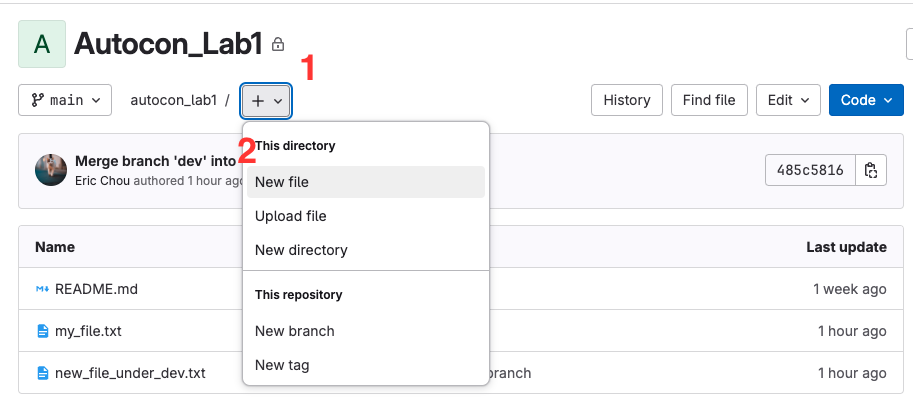
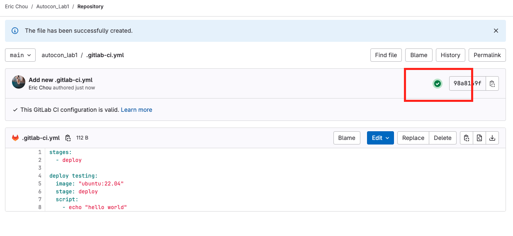
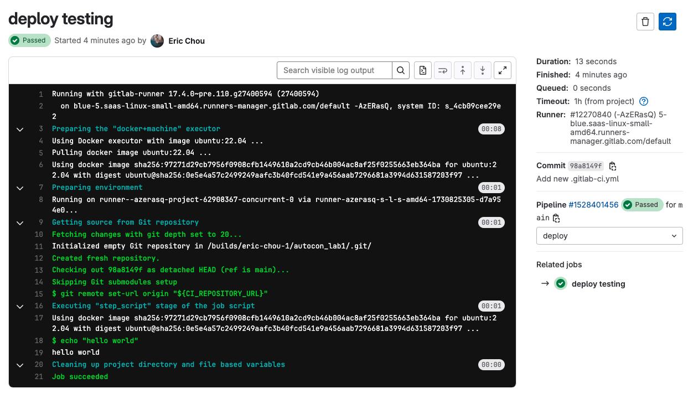
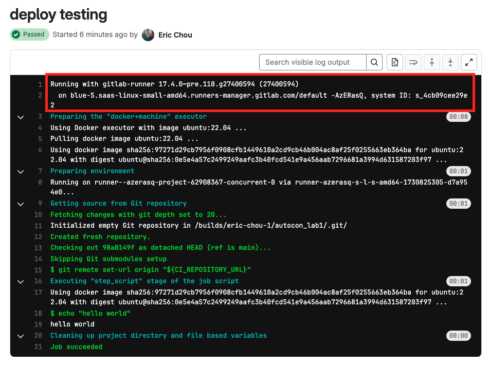
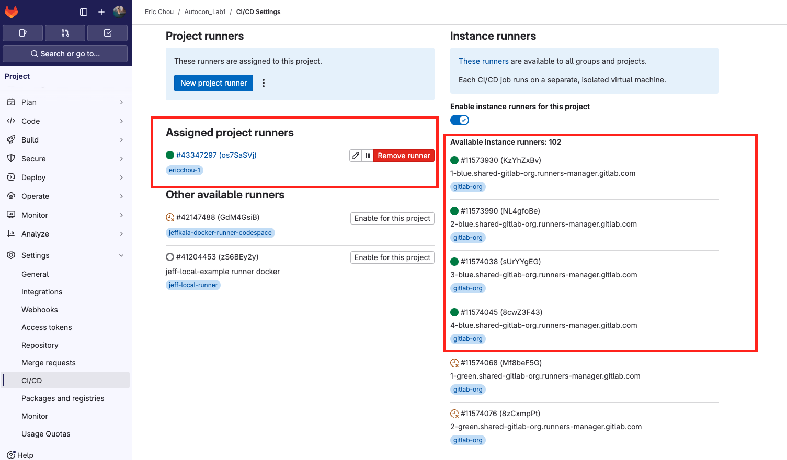
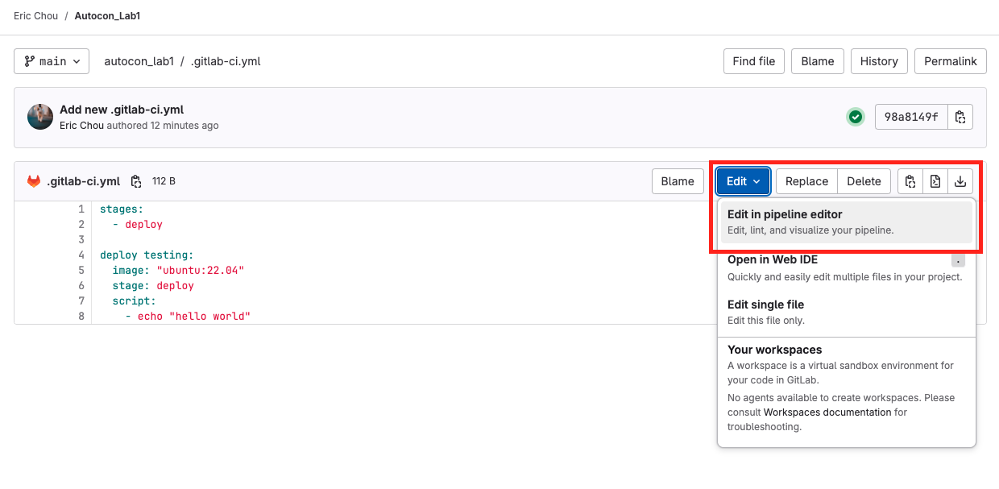
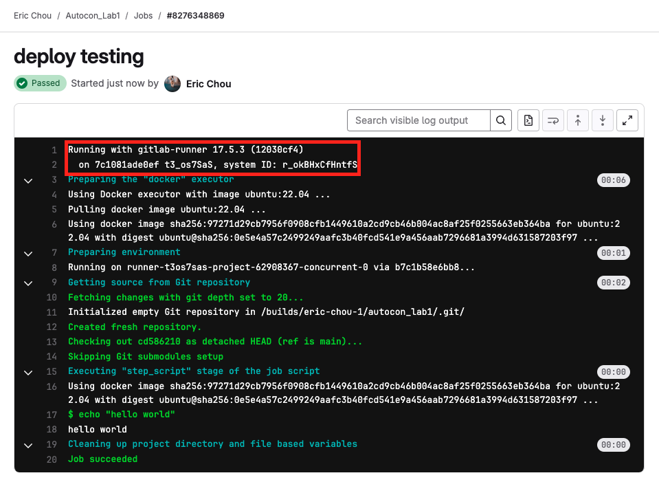
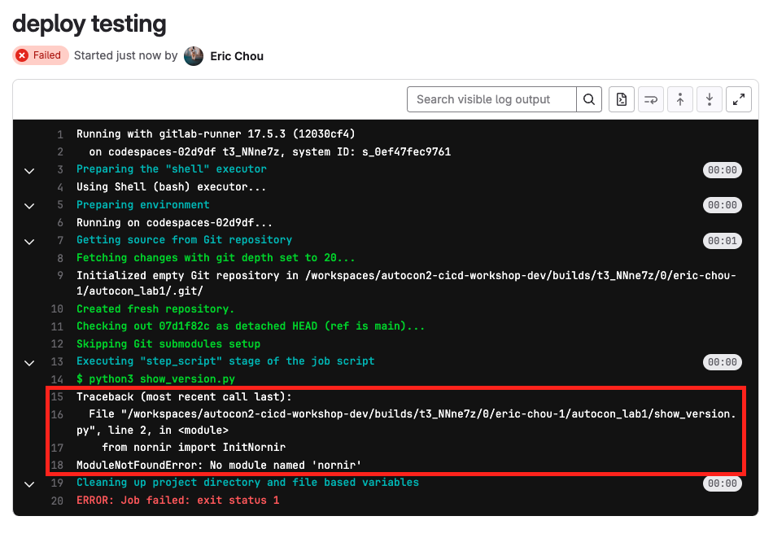

# Lab 2. First Pipeline

In this lab, we will start to build our CI/CD pipeline on GitLab. If you have not done so already, please follow the steps in [README](../README.md) and make sure you have the environment set up and ready to go. 

## Hello World Pipeline

In this lab, we will use the same [GitLab Project](../Lab_1_Basic_Git_Operations/README.md) we set up in the last lab, however, please feel free to create another project if you'd like. 

Let's create a new file named ```.gitlab-ci.yml``` at the root level of the project. The name and the location are important. 



In the file, we will have the following content and use "main" as the target branch: 

```
stages: 
  - deploy

deploy testing:
  image: "ubuntu:22.04"
  stage: deploy
  script: 
    - echo "hello world"
```

Once created, the following page will have a circle showing the gitlab-runner status: 



We can clicked on it, which will bring us to the detail page: 


We can click on the green circle under Pipeline to bring up the log details: 



At this point, we can see that the pipeline allows us to commands on a remote runner, that is great!

But hold on a second, if we take a closer look, we can see the runner that ran this job was a shared runner: 



If we go back to our CI/CD -> Runners page, we can see there are both the runners we registered under our Codespace, as well as shared runners provided by GitLab: 



We will add a tag to the stage to allow us to pin the job to the particular runner. We can go back to ```.gitlab-ci.yml``` file and edit it directly in the page: 



Add the tag to what you have set it out when the runner was registered, for me, it was ```ericchou-1```: 

```
stages: 
  - deploy

deploy testing:
  image: "ubuntu:22.04"
  stage: deploy
  tags: 
    - "ericchou-1"
  script: 
    - echo "hello world"
```

Now when we look at the detail page, we can match it up with the previously registered runner (such as the name of the runner 7c1081ade0ef): 



```
$ docker run --rm -it -v /srv/gitlab-runner/config:/etc/gitlab-runner gitlab/gitlab-runner register
Runtime platform                                    arch=amd64 os=linux pid=7 revision=12030cf4 version=17.5.3
<skip>
Verifying runner... is valid                        runner=t3_os7SaS
Enter a name for the runner. This is stored only in the local config.toml file:
[7c1081ade0ef]: 
<skip>
```

Cool, we are moving right along. Let's build on this example with a Netmiko script. 

## Launch Containerlab

We have pre-installe containerlab executable and the topology file during the Codespace built process. In a separate terminal window, let's launch the lab: 

```
$ pwd
/workspaces/autocon2-cicd-workshop

$ cd clab/
$ ls -lia
total 16
1835105 drwxrwxrwx+  3 vscode root 4096 Nov  5 16:28 .
1835018 drwxrwxrwx+ 11 vscode root 4096 Nov  5 16:35 ..
1835106 -rw-rw-rw-   1 vscode root  877 Nov  5 16:28 ceos-lab.clab.yml
1835107 drwxrwxrwx+  2 vscode root 4096 Nov  5 16:28 startup-configs

$ sudo containerlab deploy --topo ceos-lab.clab.yml 
INFO[0000] Containerlab v0.59.0 started                 
INFO[0000] Parsing & checking topology file: ceos-lab.clab.yml 
WARN[0000] Unable to init module loader: stat /lib/modules/6.5.0-1025-azure/modules.dep: no such file or directory. Skipping... 
INFO[0000] Creating lab directory: /workspaces/autocon2-cicd-workshop/clab/clab-ceos-lab 
INFO[0000] Creating container: "ceos-04"                
INFO[0000] Creating container: "ceos-02"                
INFO[0000] Running postdeploy actions for Arista cEOS 'ceos-02' node 
INFO[0000] Running postdeploy actions for Arista cEOS 'ceos-04' node 
<skip>
...
INFO[0095] Adding containerlab host entries to /etc/hosts file 
INFO[0095] Adding ssh config for containerlab nodes     
+---+---------+--------------+--------------+------+---------+---------------+--------------+
| # |  Name   | Container ID |    Image     | Kind |  State  | IPv4 Address  | IPv6 Address |
+---+---------+--------------+--------------+------+---------+---------------+--------------+
| 1 | ceos-01 | 4ff16102a5a6 | ceos:4.32.0F | ceos | running | 172.17.0.3/16 | N/A          |
| 2 | ceos-02 | da1b8b20fac1 | ceos:4.32.0F | ceos | running | 172.17.0.4/16 | N/A          |
+---+---------+--------------+--------------+------+---------+---------------+--------------+
```

> [!NOTE] To save some resources, I am only building the lab with 2 nodes, your output might look different with additional nodes. 

We can do some reachability testing to make sure the nodes are up and running: 

```
$ ssh admin@172.17.0.4
The authenticity of host '172.17.0.4 (172.17.0.4)' can't be established.
ED25519 key fingerprint is SHA256:ZVSIaFxsFSTD3vGFDY1sglAXMIOLs3ynb4PXu0oPB6A.
This key is not known by any other names
Are you sure you want to continue connecting (yes/no/[fingerprint])? yes
Warning: Permanently added '172.17.0.4' (ED25519) to the list of known hosts.
(admin@172.17.0.4) Password: 
ceos-02>exit
Connection to 172.17.0.4 closed.

$ ssh admin@172.17.0.3
(admin@172.17.0.3) Password: 
Last login: Tue Nov  5 17:27:46 2024 from 172.17.0.1
ceos-01>exit
```

Once the lab is ready, we can move on to create a Netmiko script. 

## Create Netmiko Python script 

In this step, we are mainly focused on creating a Python script that can communicate with the network devices. At this point, we are not worrying about the gitlab-runner or any pipeline. 

We will open up another terminal window and install the dependencies: 

```
$ pip3 install nornir_utils nornir_netmiko
```

We will create the hosts.yaml file required for Netmiko, please note the IP will need to match the IP assigned to the containerlab from the last step: 

```
$ cat hosts.yaml 
---
eos-1:
    hostname: '172.17.0.3'
    port: 22
    username: 'admin'
    password: 'admin'
    platform: 'arista_eos'

eos-2:
    hostname: '172.17.0.4'
    port: 22
    username: 'admin'
    password: 'admin'
    platform: 'arista_eos'
```

We will create the following ```show_version.py``` file in the same location: 

```
#!/usr/bin/env python
from nornir import InitNornir
from nornir_netmiko import netmiko_send_command
from nornir_utils.plugins.functions import print_result

# Initialize Nornir, by default it will look for the 
# hosts.yaml file in the same directory. 
nr = InitNornir()

# Run the show version command for each of the devices. 
# store the value in the results variable. 
result = nr.run(
    task=netmiko_send_command,
    command_string="show version"
)

# print the results in 
print_result(result)
```

Let's run this script to make sure it works: 

```
$ python3 show_version.py 
netmiko_send_command************************************************************
* eos-1 ** changed : False *****************************************************
vvvv netmiko_send_command ** changed : False vvvvvvvvvvvvvvvvvvvvvvvvvvvvvvvvvvv INFO
Arista cEOSLab
Hardware version: 
Serial number: 970C2A3DEA7A3E1C730AD4FD47A75A27
Hardware MAC address: 001c.7346.2f03
System MAC address: 001c.7346.2f03

Software image version: 4.32.0F-36401836.4320F (engineering build)
Architecture: x86_64
Internal build version: 4.32.0F-36401836.4320F
Internal build ID: e97bbe15-478c-45d1-84fa-332db23aef84
Image format version: 1.0
Image optimization: None

cEOS tools version: (unknown)
Kernel version: 6.5.0-1025-azure

Uptime: 17 minutes
Total memory: 8119860 kB
Free memory: 2949288 kB

^^^^ END netmiko_send_command ^^^^^^^^^^^^^^^^^^^^^^^^^^^^^^^^^^^^^^^^^^^^^^^^^^
* eos-2 ** changed : False *****************************************************
vvvv netmiko_send_command ** changed : False vvvvvvvvvvvvvvvvvvvvvvvvvvvvvvvvvvv INFO
Arista cEOSLab
Hardware version: 
Serial number: 868F6472C3E2BA30C656579193F18681
Hardware MAC address: 001c.7398.de1a
System MAC address: 001c.7398.de1a

Software image version: 4.32.0F-36401836.4320F (engineering build)
Architecture: x86_64
Internal build version: 4.32.0F-36401836.4320F
Internal build ID: e97bbe15-478c-45d1-84fa-332db23aef84
Image format version: 1.0
Image optimization: None

cEOS tools version: (unknown)
Kernel version: 6.5.0-1025-azure

Uptime: 17 minutes
Total memory: 8119860 kB
Free memory: 2949288 kB

^^^^ END netmiko_send_command ^^^^^^^^^^^^^^^^^^^^^^^^^^^^^^^^^^^^^^^^^^^^^^^^^^
```

Great! This script works, let's see how we can move this to a CI/CD pipeline and allow the runners to execute the script. 

## Move Script to Pipeline

The first thing we will do is to move the hosts.yaml and show_version.py files to the project directory. In the steps below we show how to do this in Codespace via command line, but it can also be done on the web interface on GitLab. 

```
$ cd autocon_lab1/

$ mv ../hosts.yaml .
$ mv ../show_version.py .

$ ls
hosts.yaml  my_file.txt  new_file_under_dev.txt  README.md  show_version.py
```

We will also do a ```git pull``` to pull down the ```.gitlab-ci.yml``` file: 

```
$ git pull
remote: Enumerating objects: 7, done.
remote: Counting objects: 100% (7/7), done.
remote: Compressing objects: 100% (6/6), done.
remote: Total 6 (delta 3), reused 0 (delta 0), pack-reused 0 (from 0)
Unpacking objects: 100% (6/6), 625 bytes | 312.00 KiB/s, done.
From gitlab.com:eric-chou-1/autocon_lab1
   485c581..cd58621  main       -> origin/main
Updating 485c581..cd58621
Fast-forward
 .gitlab-ci.yml | 10 ++++++++++
 1 file changed, 10 insertions(+)
 create mode 100644 .gitlab-ci.yml
 ```

 We will swap out the ```echo "hello world"``` in the ```.gitlab-ci.yml``` file as well as change the base image to ```python:3.10```:  

 ```
 stages: 
  - deploy

deploy testing:
  image: "python:3.10"
  stage: deploy
  tags: 
    - "ericchou-1"
  script: 
    - python3 show_version.py
 ```

We will need to commit the files and push to the remote repository: 

```
$ git add .gitlab-ci.yml hosts.yaml show_version.py

$ git commit -m "modified .gitlab-ci.yml, added hosts.yaml and show_version.py"
[main 2252bbd] modified .gitlab-ci.yml, added hosts.yaml and show_version.py
 3 files changed, 34 insertions(+), 1 deletion(-)
 create mode 100644 hosts.yaml
 create mode 100644 show_version.py

$ git push 
Enumerating objects: 7, done.
Counting objects: 100% (7/7), done.
Delta compression using up to 2 threads
Compressing objects: 100% (5/5), done.
Writing objects: 100% (5/5), 913 bytes | 913.00 KiB/s, done.
Total 5 (delta 1), reused 0 (delta 0), pack-reused 0 (from 0)
To gitlab.com:eric-chou-1/autocon_lab1.git
   cd58621..2252bbd  main -> main
```

When we hop back to the GitLab repository, we see the pipeline failed: 


If we take a closer look, we can see the reason for the failure is becuase the runners do not have necessary nornir packages. 



This brings up an important point, it is that each runner is self-containerd and ran atomically. We need to make sure all the necessary steps are listed out in the pipeline. 

Here is a modified version of the ```.gitlab-ci.yml``` file: 

```
stages: 
  - deploy

deploy testing:
  image: "python:3.10"
  stage: deploy
  tags: 
    - "ericchou-1"

  script: 
    - pip3 install nornir_utils nornir_netmiko
    - python3 show_version.py
```

Let's commit and up it upstream: 

```
$ git add .gitlab-ci.yml 
$ git commit -m "modified gitlab-ci.yml"
$ git push origin main
```

The pipeline is now successful.


Here is the full output log: 

```
Running with gitlab-runner 17.5.3 (12030cf4)
  on codespaces-02d9df t3_NNne7z, system ID: s_0ef47fec9761
Preparing the "shell" executor
00:00
Using Shell (bash) executor...
Preparing environment
00:00
Running on codespaces-02d9df...
Getting source from Git repository
00:01
Fetching changes with git depth set to 20...
Reinitialized existing Git repository in /workspaces/autocon2-cicd-workshop-dev/builds/t3_NNne7z/0/eric-chou-1/autocon_lab1/.git/
Checking out 66eae4e5 as detached HEAD (ref is main)...
Removing nornir.log
Skipping Git submodules setup
Executing "step_script" stage of the job script
00:01
$ pip3 install nornir_utils nornir_netmiko
Defaulting to user installation because normal site-packages is not writeable
Requirement already satisfied: nornir_utils in /home/vscode/.local/lib/python3.10/site-packages (0.2.0)
Requirement already satisfied: nornir_netmiko in /home/vscode/.local/lib/python3.10/site-packages (1.0.1)
Requirement already satisfied: nornir<4,>=3 in /home/vscode/.local/lib/python3.10/site-packages (from nornir_utils) (3.4.1)
Requirement already satisfied: colorama<0.5.0,>=0.4.3 in /home/vscode/.local/lib/python3.10/site-packages (from nornir_utils) (0.4.6)
Requirement already satisfied: netmiko<5.0.0,>=4.0.0 in /home/vscode/.local/lib/python3.10/site-packages (from nornir_netmiko) (4.4.0)
Requirement already satisfied: textfsm>=1.1.3 in /home/vscode/.local/lib/python3.10/site-packages (from netmiko<5.0.0,>=4.0.0->nornir_netmiko) (1.1.3)
Requirement already satisfied: pyyaml>=5.3 in /home/vscode/.local/lib/python3.10/site-packages (from netmiko<5.0.0,>=4.0.0->nornir_netmiko) (6.0.2)
Requirement already satisfied: pyserial>=3.3 in /home/vscode/.local/lib/python3.10/site-packages (from netmiko<5.0.0,>=4.0.0->nornir_netmiko) (3.5)
Requirement already satisfied: paramiko>=2.9.5 in /home/vscode/.local/lib/python3.10/site-packages (from netmiko<5.0.0,>=4.0.0->nornir_netmiko) (3.5.0)
Requirement already satisfied: ntc-templates>=3.1.0 in /home/vscode/.local/lib/python3.10/site-packages (from netmiko<5.0.0,>=4.0.0->nornir_netmiko) (7.4.0)
Requirement already satisfied: cffi>=1.17.0rc1 in /home/vscode/.local/lib/python3.10/site-packages (from netmiko<5.0.0,>=4.0.0->nornir_netmiko) (1.17.1)
Requirement already satisfied: setuptools>=65.0.0 in /home/vscode/.local/lib/python3.10/site-packages (from netmiko<5.0.0,>=4.0.0->nornir_netmiko) (75.3.0)
Requirement already satisfied: scp>=0.13.6 in /home/vscode/.local/lib/python3.10/site-packages (from netmiko<5.0.0,>=4.0.0->nornir_netmiko) (0.15.0)
Requirement already satisfied: ruamel.yaml>=0.17 in /home/vscode/.local/lib/python3.10/site-packages (from nornir<4,>=3->nornir_utils) (0.18.6)
Requirement already satisfied: mypy_extensions<2.0.0,>=1.0.0 in /home/vscode/.local/lib/python3.10/site-packages (from nornir<4,>=3->nornir_utils) (1.0.0)
Requirement already satisfied: pycparser in /home/vscode/.local/lib/python3.10/site-packages (from cffi>=1.17.0rc1->netmiko<5.0.0,>=4.0.0->nornir_netmiko) (2.22)
Requirement already satisfied: cryptography>=3.3 in /home/vscode/.local/lib/python3.10/site-packages (from paramiko>=2.9.5->netmiko<5.0.0,>=4.0.0->nornir_netmiko) (43.0.3)
Requirement already satisfied: bcrypt>=3.2 in /home/vscode/.local/lib/python3.10/site-packages (from paramiko>=2.9.5->netmiko<5.0.0,>=4.0.0->nornir_netmiko) (4.2.0)
Requirement already satisfied: pynacl>=1.5 in /home/vscode/.local/lib/python3.10/site-packages (from paramiko>=2.9.5->netmiko<5.0.0,>=4.0.0->nornir_netmiko) (1.5.0)
Requirement already satisfied: ruamel.yaml.clib>=0.2.7 in /home/vscode/.local/lib/python3.10/site-packages (from ruamel.yaml>=0.17->nornir<4,>=3->nornir_utils) (0.2.12)
Requirement already satisfied: six in /home/vscode/.local/lib/python3.10/site-packages (from textfsm>=1.1.3->netmiko<5.0.0,>=4.0.0->nornir_netmiko) (1.16.0)
Requirement already satisfied: future in /home/vscode/.local/lib/python3.10/site-packages (from textfsm>=1.1.3->netmiko<5.0.0,>=4.0.0->nornir_netmiko) (1.0.0)
$ python3 show_version.py
netmiko_send_command************************************************************
* eos-1 ** changed : False *****************************************************
vvvv netmiko_send_command ** changed : False vvvvvvvvvvvvvvvvvvvvvvvvvvvvvvvvvvv INFO
Arista cEOSLab
Hardware version: 
Serial number: 225EF9483A61E4548BA2BF0C9BD8EFE0
Hardware MAC address: 001c.73f7.5a7f
System MAC address: 001c.73f7.5a7f
Software image version: 4.32.0F-36401836.4320F (engineering build)
Architecture: x86_64
Internal build version: 4.32.0F-36401836.4320F
Internal build ID: e97bbe15-478c-45d1-84fa-332db23aef84
Image format version: 1.0
Image optimization: None
cEOS tools version: (unknown)
Kernel version: 6.5.0-1025-azure
Uptime: 1 minute
Total memory: 16364588 kB
Free memory: 10560976 kB
^^^^ END netmiko_send_command ^^^^^^^^^^^^^^^^^^^^^^^^^^^^^^^^^^^^^^^^^^^^^^^^^^
* eos-2 ** changed : False *****************************************************
vvvv netmiko_send_command ** changed : False vvvvvvvvvvvvvvvvvvvvvvvvvvvvvvvvvvv INFO
Arista cEOSLab
Hardware version: 
Serial number: 03F75C6F47DE04B9ED362BBBBFF4679C
Hardware MAC address: 001c.73ea.e983
System MAC address: 001c.73ea.e983
Software image version: 4.32.0F-36401836.4320F (engineering build)
Architecture: x86_64
Internal build version: 4.32.0F-36401836.4320F
Internal build ID: e97bbe15-478c-45d1-84fa-332db23aef84
Image format version: 1.0
Image optimization: None
cEOS tools version: (unknown)
Kernel version: 6.5.0-1025-azure
Uptime: 1 minute
Total memory: 16364588 kB
Free memory: 10560976 kB
^^^^ END netmiko_send_command ^^^^^^^^^^^^^^^^^^^^^^^^^^^^^^^^^^^^^^^^^^^^^^^^^^
Cleaning up project directory and file based variables
00:00
Job succeeded
```

## Next Steps

Congratulations on building your first Pipeline! This is a huge step forward. In the next lab, we will take a look at some of the tools to help the team collaborate together. 


