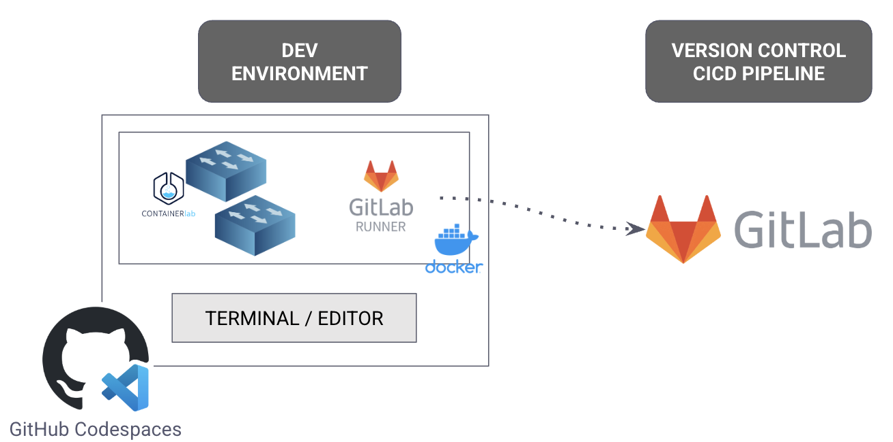
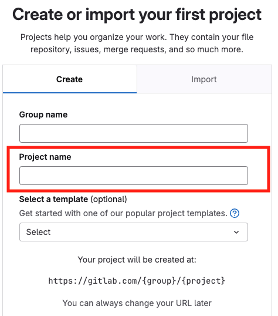
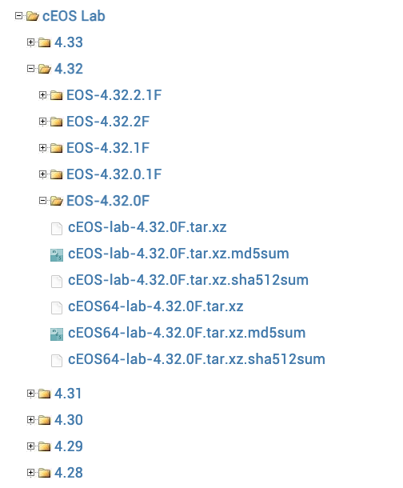

# Autocon2 CI/CD Workshop Development Repository

Hello! Welcome to [Autocon2 CI/CD workshop](https://networkautomation.forum/autocon2#workshop) proctored by [Eric Chou](https://github.com/ericchou1/), [Jeff Kala](https://github.com/jeffkala), and assisted by [Tim Fiola](https://github.com/tim-fiola). 

You can find the different lab instructions in each of the folders in this repository. 

- [Lab 1. Basic Git Operations](./Lab_1_Basic_Git_Operations/README.md)
- [Lab 2. First Pipeline](./Lab_2_First_Pipeline/README.md)
- [Lab 3. Collaboration Tools](./Lab_3_Collaboration_Tools/README.md)
- [Lab 4. Source Code Checks](./Lab_4_Source_Code_Checks/README.md)
- [Lab 5. Generate Configs](./Lab_5_Generate_Configs/README.md)
- [Lab 6. Testing Frameworks](./Lab_6_Testing_Frameworks/README.md)

But first things first, we would like to walk you through how to set up the development environment for the workshop.

## Lab Components

Here is an overview of lab:   



Here are the details regarding each components: 

- [GitLab](https://about.gitlab.com/pricing/): We will use the SaaS version of GitLab as the CI server. The CI server handles the committing, building, testing, staging, and releasing the changes. 
- [GitLab Runners](https://docs.gitlab.com/runner/): GitLab runners are workers that registers itself with the GitLab server and managed by the GitLab server. They are responsible to carry out the instructions by the GitLab server. 
- [GitHub Codespace](https://github.com/features/codespaces): We will use GitHub codepsace as our IDE as well as the virtual server to run our network lab. GitHub provides these container-based development environment for developers. We will use Containerlab to run a few network devices for our lab. GitHub offer a generous free tier in Codespace that should remain to be free for the duration of this lab. 
- [Containerlab](https://containerlab.dev/): We will use containerlab for our lab devices running inside of codepsace.  
- [Arista cEOS](https://containerlab.dev/manual/kinds/ceos/): We will use Arista cEOS for our lab for their light overhead and relative high adaption in production networks. 

## GitLab Account Registration and cEOS Download

Please do the following steps to set up the lab: 

1. Register for a free GitLab.com account [here](https://gitlab.com/users/sign_up) if you do not have one. For a new registration, a project name is required, you can use a temp name or 'Autocon_Lab1' as that is one of the project we will create later: 

> [!FYI] 
> If you registered a new account, you **must** do the email verfication of the new account or you may see issues later.




2. Download the free Arista cEOS image [here](https://www.arista.com/en/login). The image is free but you do need to register an Arista account with your business email. We will import the Arista image Codespace later. 


Please download images later than 4.28. We will use 4.32.0F for our lab. 



> [!FYI] 
> Download the 64 bit image.

> [!TIP]
You just need to download the image for now, for reference here is the import instruction from [containerlab](https://www.youtube.com/watch?v=KJMVH2okO24) and a nice walk through video from [Roman](https://www.youtube.com/watch?v=KJMVH2okO24). 

### Lab Setup

Alright, now it is time to tie everything together. 

1. In this repository, we can start Codespace by going to Code button on the top left corner and choose 'Create codespace on main': 


> [!TIP] 
> It will take a bit of time to build codespace for the first time, you can click on [building codespace](images/building_codespace.png) to check on the progress. After it started for the first time, when you stop/start the instance it will be much faster. 

Once Codespace is started, we can verify both Docker and containerlab are installed and running: 

```
@ericchou1 ➜ /workspaces/autocon2-cicd-workshop-dev (main) $ poetry --version
Poetry (version 1.8.4)

@ericchou1 ➜ /workspaces/autocon2-cicd-workshop-dev (main) $ docker run hello-world
Unable to find image 'hello-world:latest' locally
latest: Pulling from library/hello-world
...<skip>
Hello from Docker!
This message shows that your installation appears to be working correctly.
<skip>

@ericchou1 ➜ /workspaces/autocon2-cicd-workshop-dev (main) $ containerlab version
  ____ ___  _   _ _____  _    ___ _   _ _____ ____  _       _     
 / ___/ _ \| \ | |_   _|/ \  |_ _| \ | | ____|  _ \| | __ _| |__  
| |  | | | |  \| | | | / _ \  | ||  \| |  _| | |_) | |/ _` | '_ \ 
| |__| |_| | |\  | | |/ ___ \ | || |\  | |___|  _ <| | (_| | |_) |
 \____\___/|_| \_| |_/_/   \_\___|_| \_|_____|_| \_\_|\__,_|_.__/ 

    version: 0.58.0
     commit: 2c249b2c
       date: 2024-10-15T11:38:50Z
     source: https://github.com/srl-labs/containerlab
 rel. notes: https://containerlab.dev/rn/0.58/
```

2. After codespace is started, right click in the Explorer section and choose upload: 


3. Use command ```docker import cEOS64.<version>.tar.xz ceos:<version>``` to import the image, for example: 

```sh
docker import cEOS64-lab-4.32.0F.tar ceos:4.32.0F
```

4. Run the GitLab Runner in a docker container.

```sh
docker run -d --name gitlab-runner --restart always \
-v /srv/gitlab-runner/config:/etc/gitlab-runner \
-v /var/run/docker.sock:/var/run/docker.sock \
gitlab/gitlab-runner:latest
```

5. Register GitLab Runner (screenshot following the steps): 
    - Under the GitLab project you created, get runner token via Project -> Settings -> CI/CD -> Project Runners. 
    - When creating this runner, we will use tags recommend something like `first-last-01` to specify the jobs this runner can pickup. 
    - Copy the `token`.
    - Come back to the Codespace instance.
    - Register runner via the following command `docker run --rm -it -v /srv/gitlab-runner/config:/etc/gitlab-runner gitlab/gitlab-runner register`
    - Answer the questions:
      - Enter GitLab instance: `https://gitlab.com/`
      - Enter the registration token: `<token you copied previously>`
      - Enter name for the runner: `leave the default`
      - Enter an executor: `docker`
      - Enter the default Docker image: `python:3.10`


```sh
$ docker run --rm -it -v /srv/gitlab-runner/config:/etc/gitlab-runner gitlab/gitlab-runner register
Runtime platform arch=amd64 os=linux pid=7 revision=c6eae8d7 version=17.5.2

Running in system-mode.

Enter the GitLab instance URL (for example, https://gitlab.com/):
https://gitlab.com/

Enter the registration token:
glrt-t3_ABC123

Verifying runner... is valid runner=t3_GdM4Gs

Enter a name for the runner. This is stored only in the local config.toml file:
[460ba0646748]:

Enter an executor: custom, virtualbox, docker, instance, shell, ssh, parallels, docker-windows, docker+machine, kubernetes, docker-autoscaler:
docker

Enter the default Docker image (for example, ruby:2.7):
python:3.10

Runner registered successfully. Feel free to start it, but if it's running already the config should be automatically reloaded!
Configuration (with the authentication token) was saved in "/etc/gitlab-runner/config.toml"
```


## Lab Setup Walkthrough Video

Here are video walkthrough to help with illustrate the lab setup. 

Video 1. Overview and Software Download

[](https://www.youtube.com/watch?v=p7FcvGOZHuY)

Video 2. Codespace Launch and Preparation

[](https://www.youtube.com/watch?v=FbbZD1IWgFA)

Video 3. Create Gitlab Project

[](https://www.youtube.com/watch?v=Rqtnxg9mPmM)

Video 4. Runner Registration

[](https://www.youtube.com/watch?v=I3ng43OSUjc)

That is it, having gone thru the steps will ensure we can jump right into the workshop lab at Autocon2. 

Below is an optional step for those who are somewhat familiar with Gitlab and want to check the end-to-end setup. 

## (Optional) Checking for end-to-end Lab Setup

This is complete optional and we will go over it in the workshop as our first lab, but if you are up for some testing, we can test the end-to-end lab setup with the following steps. 

- Start containerlab (and use --node-filter to only create 2 nodes for now.)

```
@jeffkala ➜ /workspaces/autocon2-cicd-workshop (main) $ cd clab/


@jeffkala ➜ /workspaces/autocon2-cicd-workshop/clab (main) $ sudo containerlab deploy --topo ceos-lab.clab.yml --node-filter ceos-01,ceos-02
INFO[0000] Containerlab v0.59.0 started                 
INFO[0000] Applying node filter: ["ceos-01" "ceos-02"]  
INFO[0000] Parsing & checking topology file: ceos-lab.clab.yml 
WARN[0000] Unable to init module loader: stat /lib/modules/6.5.0-1025-azure/modules.dep: no such file or directory. Skipping... 
INFO[0000] Creating lab directory: /workspaces/autocon2-cicd-workshop/clab/clab-ceos-lab 
INFO[0000] Creating container: "ceos-02"                
INFO[0000] Creating container: "ceos-01"                
INFO[0000] Running postdeploy actions for Arista cEOS 'ceos-01' node 
INFO[0000] Created link: ceos-01:eth1 <--> ceos-02:eth1 
INFO[0000] Running postdeploy actions for Arista cEOS 'ceos-02' node 
INFO[0046] Adding containerlab host entries to /etc/hosts file 
INFO[0046] Adding ssh config for containerlab nodes     
+---+---------+--------------+--------------+------+---------+---------------+--------------+
| # |  Name   | Container ID |    Image     | Kind |  State  | IPv4 Address  | IPv6 Address |
+---+---------+--------------+--------------+------+---------+---------------+--------------+
| 1 | ceos-01 | a425c6fb993a | ceos:4.32.0F | ceos | running | 172.17.0.3/16 | N/A          |
| 2 | ceos-02 | 44ad61fe178c | ceos:4.32.0F | ceos | running | 172.17.0.4/16 | N/A          |
+---+---------+--------------+--------------+------+---------+---------------+--------------+
```

 - Create a test project(back in GitLab) with the following `hosts.yaml` file

> [!info]
> Best to create a brand new project as `Autocon_Lab1` you created originally is going to be built upon in the following labs.

```yml
---
eos-1:
    hostname: '172.17.0.3'  # Update if your deploy chose different IPs
    port: 22
    username: 'admin'
    password: 'admin'
    platform: 'arista_eos'

eos-2:
    hostname: '172.17.0.4'  # Update if your deploy chose different IPs
    port: 22
    username: 'admin'
    password: 'admin'
    platform: 'arista_eos'
```

- Create the following `show_version.py` file

```python
#!/usr/bin/env python
from nornir import InitNornir
from nornir_netmiko import netmiko_send_command
from nornir_utils.plugins.functions import print_result

# Initialize Nornir, by default it will look for the 
# hosts.yaml file in the same directory. 
nr = InitNornir()

# Run the show version command for each of the devices. 
# store the value in the results variable. 
result = nr.run(
    task=netmiko_send_command,
    command_string="show version"
)

# print the results in 
print_result(result)
```

- Create the following CI file `.gitlab-ci.yml`

 ```yml
stages: 
  - deploy

deploy testing:
  image: "python:3.10"
  stage: deploy
  tags: 
    - "ericchou-1"  # Update this with the tag you add to your runner.
  script: 
    - pip3 install nornir_utils nornir_netmiko
    - python3 show_version.py
 ```

- You should see the following result by navigating to Build --> Pipelines: 


## Final Lab Walk-Through

We encourage you to perform the labs first, if you run into any issues and prefer to see a walk-through for the labs, we prepared the following videos: 

- [Lab 0. Preparation](https://www.youtube.com/watch?v=khg4QeWR-bI&list=PLAaTeRWIM_wtlNigH6vmUlfwM1-BD9mQH&index=1)
- [Lab 1. Basic Git Operations](https://www.youtube.com/watch?v=a1lfu4FKwt8&list=PLAaTeRWIM_wtlNigH6vmUlfwM1-BD9mQH&index=2)
- [Lab 2. First Pipeline](https://www.youtube.com/watch?v=Ftl8vABR1R0&list=PLAaTeRWIM_wtlNigH6vmUlfwM1-BD9mQH&index=3)
- [Lab 3. Collaboration Tools](https://www.youtube.com/watch?v=03vlGKHs9Tc&list=PLAaTeRWIM_wtlNigH6vmUlfwM1-BD9mQH&index=4)
- [Lab 4. Source Code Checks](https://www.youtube.com/watch?v=i4gffAeCQ0o&list=PLAaTeRWIM_wtlNigH6vmUlfwM1-BD9mQH&index=5)
- [Lab 5. Generate Configs](https://www.youtube.com/watch?v=SNhDoPAMRkw&list=PLAaTeRWIM_wtlNigH6vmUlfwM1-BD9mQH&index=6)
- [Lab 6. Testing Frameworks](https://www.youtube.com/watch?v=c7O_fV5SZpg&list=PLAaTeRWIM_wtlNigH6vmUlfwM1-BD9mQH&index=7)
